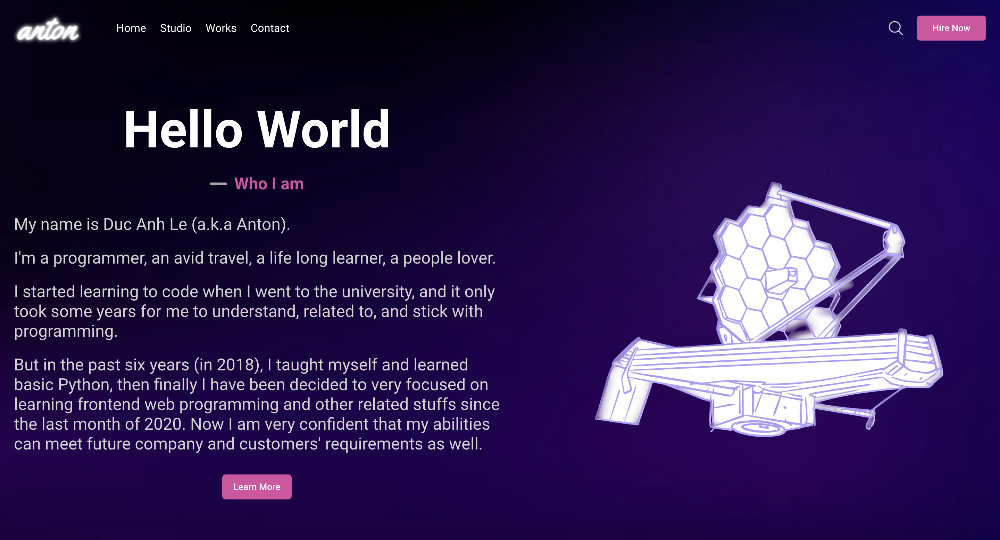

# Portfolio with React and ThreeJs

### The application does the following:

-   introduce the author, work experience and projects,
-   allow users to contact and send message to author by submitting form

## Live Demo

[View Live Version](https://portfolio-ducanh4531.vercel.app/)

<!-- [View Live Version](https://ducanhle.codes/) -->

## How-to Guide

[Read the article on ...](link)

## Installation

-   Clone the project repository. Don't forget to star the repo 😉
-   Run `yarn install` to install its dependencies.
-   Start the development server by running `yarn run dev`

## Tools

-   [React](https://react.dev/)
-   [styled-components](https://styled-components.com/)
-   [ThreeJs](https://threejs.org/)
-   [React Simple Maps](https://www.react-simple-maps.io/)
